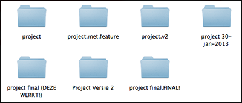

Git Workshop
============
Door: Paul Wagener

Deelnemers: Bart van Lierop (bvanlierop)

Versie beheer systeem
-----------
Waarom zou je een versie beheer systeem willen gebruiken? Als je lang genoeg aan een project werkt maak je fouten en die zijn er niet altijd gemakkelijk weer uit te halen zijn. Het is dus handig om elke keer als we een versie hebben die _wel_ werkt om dit te kunnen op te slaan. Dat kunnen we natuurlijk doen door elke keer een kopie van het project te maken, maar dat resulteert al snel in een chaos van mapjes.

Dat moet makkelijker kunnen!

Met een versie beheer systeem kunnen we wijzigingen aan een project vastleggen. Elke keer als we een wijziging hebben gedaan die werkt kunnen we een _commit_ doen. Daarmee leggen we vast hoe het project er op dat moment uit ziet. Als later het project niet meer werkt of als je per ongeluk iets verwijderd kan je altijd terug naar de versie die wel werkt.

### Andere versie beheer systemen

Er zijn meerdere versie beheer systemen beschikbaar, elk met hun plus- en minpunten. Populaire systemen zijn CVS, Subversion, Mercurial en Git. In deze workshop gaan we Git gebruiken.

**Voor mensen die alleen met Subversion hebben gewerkt:** Als je alleen nog maar met CVS en Subversion hebt gewerkt gaan een aantal dingen je verwarren. Bij Subversion ben je gewend om altijd op een centrale server te committen. Bij git commit je naar een lokale repository die je vervolgens synchroniseert. Bij Subversion ben je gewend om bijna nooit te branchen, want na een tijdje moet je mergen en mergen leid tot een hele dag conflicten oplossen. Bij git kan je branchen zonder dat je bang hoeft te zijn voor een pijnlijke merge later.

Installatie
------------------

Download: http://git-scm.com/download

We gaan Git alleen op de command prompt/terminal gebruiken. Er zijn ook onofficiele GUI's maar die verschillen per besturingssysteem.

We gaan eerst wat instellingen van Git veranderen

    git config --global color.ui auto
    
    git config --global --add alias.lol "log --graph --decorate --pretty=oneline --abbrev-commit --all"

De eerste regel voegt kleurtjes toe aan de output van elke command. Met de tweede regel voegen we een commando toe die we later gaan gebruiken

We moeten ook nog aangeven wie we zijn zodat we later kunnen zien wie welke commit heeft gemaakt. Vul je eigen naam in in onderstaande commando's en voer ze uit.

    git config --global user.name "John Doe"
    git config --global user.email johndoe@example.com

Mijn eerste Git repository
-----------
Ga met de terminal naar een project wat je nog niet onder versie beheer hebt staan en typ:

    git init

Het project staat nu onder versie beheer! Ok… Wat? Het enige wat veranderd is is dat er een nieuwe directory is bij gekomen met de naam '.git'.

De .git map is de _repository_. Alle versies die we vanaf nu gaan maken komen in deze directory te staan. Laten we meteen een eerste versie committen!

Voordat je commit moet je eerst aangeven _wat_ je wilt committen. Laten we maar aangeven dat we alles willen committen:

    git add .
    git commit

Er komt nu automatisch een editor waarin je een berichtje kan opgeven wat je gewijzigd hebt. Nadat je hier wat hebt ingevuld is je eerste commit een feit.

Laten we kijken naar de commit die we net hebben gemaakt:

    git log

Voor elke commit worden een aantal dingen opgeslagen: De **auteur** (die we bij de installatie hebben aangegeven), de **datum** waarop de commit is gebeurd, een **bericht** die de auteur moet typen met een samenvatting wat er gewijzigd en een lange **hash**. De hash is een unieke identifier voor de commit waarmee we altijd terug kunnen naar deze versie.

Als we willen weten wat we hebben gewijzigd sinds de laatste commit kunnen we status gebruiken:

    git status

Maak een paar wijzingen aan het project en bekijk met git status wat je gewijzigd hebt. Als je voor elk bestand wilt zien wat er gewijzigd is gebruik je

    git diff

Het is ook mogelijk om maar een gedeelte van de wijzigingen die je gemaakt hebt te committen.

    git add -p
    git commit
    
Git vraagt dan voor elke verandering of je die wel of niet wilt committen.

Oefen nog even met bovenstaande commando's en maak nog een paar extra commits.

Branchen en mergen
-----------
Stel, je bent bezig aan een uitgebreide nieuwe feature voor een website, je hebt al wat commits gemaakt en plotseling komt de baas langs. Er zit een fout op de website en die moet je NU oplossen! Dan zou het handig zijn om al je werk aan de nieuwe feature tijdelijk aan de kant te kunnen zetten om aan een fix te werken. Zodra de fix klaar is commit je die en ga je weer verder met je nieuwe feature.

Een branch is een soort van zijspoor waar je een nieuwe feature ontwikkelen of een idee kunt uitproberen. Je kunt in een branch vrij committen. En zodra de feature klaar is merge je hem met de hoofdbranch. En als de feature een slecht idee was gooi je de hele branch weg en hoef je er nooit meer naar te kijken.

Ga naar je project en bekijk alle branches die op het moment in je project aanwezig zijn:

    git branch

Git maakt standaard een branch voor je aan genaamd 'master', deze wordt in projecten vaak gebruikt als de hoofdbranch. Het sterretje laat zien wat de huidige branch is. Laten we een nieuwe branch aanmaken:

    git branch mijn-eerste-branch

We kunnen nu wisselen naar deze branch met het checkout commando:

    git checkout mijn-eerste-branch

Maak een paar commits en schakel terug naar de master branch:
    
    git checkout master

Maak hier ook een paar commits.     

Synchroniseren met team leden
-----------

Zoals je in vorige hoofdstuk hebt gezien staat de repository lokaal op je computer in een .git directory. Alle commits, bestanden en historie staan allemaal lokaal opgeslagen. Toch is het makkelijk om samen met andere mensen aan hetzelfde project te werken.

Deze workshop die je nu aan het lezen bent staat in een online git repository. Iedereen kan deze repository via git kopiëren naar zijn eigen computer. Dit doen we met het clone commando:

    git clone https://github.com/PaulWagener/Git-Workshop.git ~/workshop

Hiermee kopieer je het project naar de workshop folder in je home ­directory. Kijk met het log commando welke wijzigingen er al aan het project zijn gebeurd.

Ik heb in dit project een verschrikkelijke https://github.com/PaulWagener/Git-Workshop.git Zpelfout zitten. Probeer deze te vinden, te verbeteren en te committen.
Merk op dat je geen speciale rechten nodig hebt om te mogen committen! Je commit is alleen lokaal opgeslagen en nog niet verstuurd naar de server. Om alle wat je commit hebt te versturen gebruik je push:

    git push

Nu pas zal git klagen dat je geen toegang hebt tot het project.
